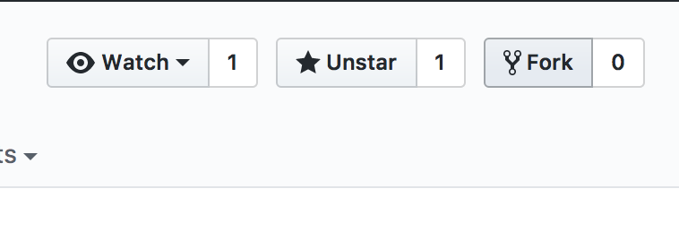
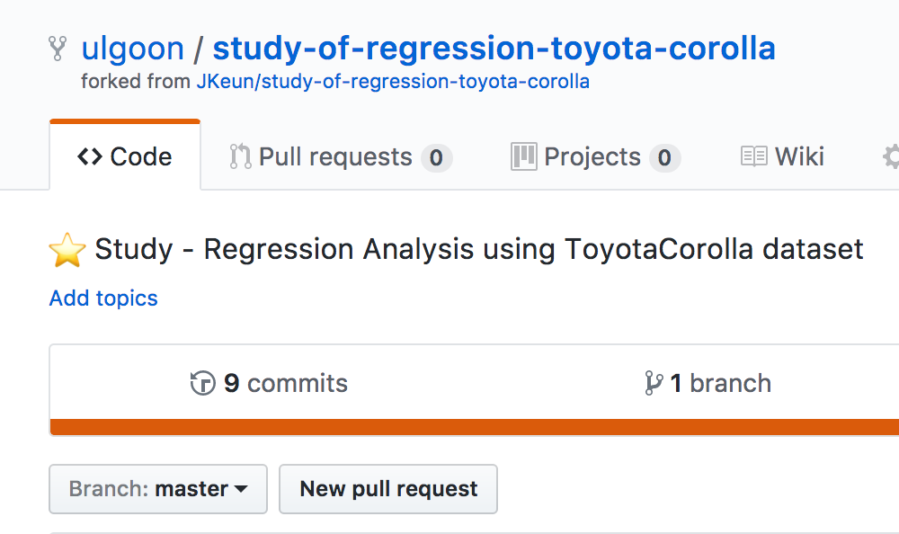

# Fastcampus
## Computer Science School
### Software Engineering

---
<!--
page_number: true
$size: A4
footer : fastcampus Computer Science School, Wooyoung Choi, 2018
-->
## Collaborate with git

---
## What is branch?

---
## What is branch?


---
## What is branch?
분기점을 생성하고 독립적으로 코드를 변경할 수 있도록 도와주는 모델

ex)

master branch
```python
print('hello world!')
```

another branch
```python
for i in range(1,10):
    print('hello world for the %s times!' % i)
```


---
## Branch

Show available local branch
`$ git branch`

Show available remote branch
`$ git branch -r`

Show available All branch
`$ git branch -a`

---
## Branch


Create branch
`$ git branch stem`

Checkout branch
`$ git checkout stem`

Create & Checkout branch
`$ git checkout -b new-stem`

make changes inside readme.md
`$ git commit -a -m 'edit readme.md'`
`$ git checkout master`

merge branch
`$ git merge stem`

---
## Branch

delete branch
`$ git branch -D stem`

push with specified remote branch
`$ git push origin stem`

see the difference between two branches
`$ git diff master stem`

---
## git flow strategy


---
## use git flow easily!
[Link](https://danielkummer.github.io/git-flow-cheatsheet/index.ko_KR.html)


---
## Collaborate with your Co-worker

---
## Method 1: Collaboration
Add Collaborator


---
## Collaboration
Add, Commit and Push like you own it. 

---
## Method 2: Fork and Merge


---
## Fork and Merge


---
## Fork and Merge


---
## Fork and Merge
`$ git clone https://github.com/username/forked-repo.git`


---
## Fork and Merge


`$ git branch -a`
`$ git checkout -b new-feature`

---
## Fork and Merge

Make some change

`$ git add file`
`$ git commit -m "commit message"`
`$ git push origin new-feature`

---
## Fork and Merge


---
## Fork and Merge


---
## Fork and Merge


---
## Fork and Merge


---
## Fork and Merge


---
## Fork and Merge


---
## Fork and Merge


## Software Engineering

---
## Software Engineering
### Definition

Software engineering (SWE) is the application of engineering to the design, development, implementation, testing and maintenance of software in a systematic method.
--> 소프트웨어의 개발, 운용, 유지보수 등의 생명 주기 전반을 체계적이고 서술적이며 정량적으로 다루는 학문

---
## Software Engineering


### Why??

---
## Development vs Implementation

- Development
	- The process of analysis, design, coding and testing software.
- Implementation
	- The installation of a computer system or an information system.
	- The use of software on a particular computer system.

---
## Trend of Software Engineering

- Acceleration of **DevOps** adoption
- Continued wave of everything natively mobile
- Greater demand for increased privacy
- Cloud computing will be a thing of the past
- integration with Web and Mobile App

---
## DevOps

used to refer to a set of practices that emphasizes the **collaboration and communication** of both software developers and other information-technology (IT) professionals while automating the process of software delivery and infrastructure changes. 
It aims at establishing a **culture** and **environment** where building, testing, and releasing software can happen **rapidly**, **frequently**, and more **reliably**.

---
## DevOps

- 기존의 개발과 운영 분리로 인해 발생하는 문제들
문제 발생 -> 비방 -> 욕 -> 상처 -> 원인분석 -> 문제해결

- 좋은 소프트웨어를 위한 필수조건
	- 기획팀과의 원활한 소통으로 요구사항을 충실히 반영
	- 운영팀과의 원활한 소통으로 소비자 불만과 의견을 반영

---
## DevOps

운영과 개발을 통합하여 커뮤니케이션 리소스를 줄이고, 개발 실패 확률을 줄임과 동시에 보다 안정적인 서비스를 운영할 수 있음!!


---
## Software Development Life Cycle

---
## Requirements Analysis

---
## Requirements
> 무엇이 구현되어야 하는가에 대한 명세

시스템이 어떻게 동작해야 하는지 혹은 시스템의 특징이나 속성에 대한 설명

---
## Requirements Analysis
시스템 공학과 소프트웨어 공학 분야에서 수혜자 또는 사용자와 같은 다양한 이해관계자의 상충할 수도 있는 요구사항을 고려하여 새로운 제품이나 변경된 제품에 부합하는 요구와 조건을 결정하는 것과 같은 업무

---
## Requirements Analysis

나(개발자)와 클라이언트(사장) 모두를 만족시키기 위한 연결고리

---
## Requirements Analysis
- 요구사항 유도(수집): 대화를 통해 요구사항을 결정하는 작업
- 요구사항 분석: 수집한 요구사항을 분석하여 모순되거나 불완전한 사항을 해결하는 것
- 요구사항 기록: 요구사항의 문서화 작업

---
## Business Requirements
> "Why"

---
## Business Requirements
> "왜" 프로젝트를 수행하는지
- 고객이 제품을 개발함으로써 얻을 수 있는 이득
- Vision and Scope(비전과 범위)

---
## User Requirements
> "What"

---
## User Requirements
> 사용자가 이 제품을 통해 할 수 있는 "무엇"
- Use cases, Scenarios, User stories, Event-response tables, ..

---
## Functional Requirements
> "What"

---
## Functional Requirements
> 개발자가 이 제품의 "무엇"을 개발할 것인지
- '~ 해야 한다' 로 끝나 반드시 수행해야 하거나 사용자가 할 수 있어야 하는 것들에 대해 작성

---
## System Requirements
- 여러개의 서브 시스템으로 구성되는 제품에 대한 최상위 요구사항을 설명
- 컴퓨터: 모니터 + 키보드 + 마우스 + 본체 + 스피커

---
## Business Rules
- 비즈니스 스트럭쳐의 요구나 제약사항을 명세
- "유저 로그인을 위해서는 페이스북 계정이 있어야 한다."
- "유저 프로필 페이지에 접근하기 위해서는 로그인되어 있어야 한다"

---
##  Quality Attribute
- 소프트웨어의 품질에 대해 명세
- "결제과정에서 100명의 사용자가 평균 1.5초의 지연시간 안에 요청을 처리해야 한다"

---
## External Interface
- 시스템과 외부를 연결하는 인터페이스
- 다른 소프트웨어, 하드웨어, 통신 인터페이스, 프로토콜, ..

---
## Constraint
- 기술, 표준, 업무, 법, 제도 등의 제약조건 명세
- 개발자들의 선택사항에 제한을 두는 것


---
## When the well is full, it will run over.

---
## 지나치게 자세한 명세작성
- 명세서는 말 그대로 명세일 뿐, 실제 개발 단계에서 마주칠 모든 것을 담을 수 없음
- 개발을 언어로 모두 표현할 수 없음
- 명세서가 완벽하다고 해서 상품도 완벽하리란 보장은 없음
- 때로는 명세를 작성하기 보단 프로토타이핑이 더 간단할 수 있음.


---
## Software Development Lifecycle Process Model

---
## Build-fix Model


---
## Build-fix Model

설계없이 일단 개발, 만족할 때까지 수정

시작이 빠름

계획이 정확하지 않음, 개발 문서가 없고 진행상황 파악이 힘듦

---
## Waterfall Model


---
## Waterfall Model

순차적인 개발 모델, 가장 많이 사용됨

정형화된 접근 가능, 체계적인 문서화 가능

직전 단계가 완료되어야 진행 가능


---
## Prototype Model


---
## Prototype Model

고객 요구사항을 적극적으로 반영하는 모델

빠른 개발과 고객 피드백을 빠르게 반영할 수 있음

대규모 프로젝트에 적용하기 힘듦

---
## Spiral Model


---
## Spiral Model

대규모 or 고비용 프로젝트

프로젝트의 위험요인을 제거해 나갈 수 있음

각 단계가 명확하지 않음

---
## 이외에도..
- RAD(Rapid Application Development) Model
- Iterative Development Model
- V Model
- Component Based Development

---
## Software Development Process
in Agile
### UP(Unified Process)
- 도입(분석위주), 상세(설계위주), 구축(구현위주), 이행(최종 릴리즈)의 반복

### XP(eXtreme Process)
- 스크럼 마스터가 주도적으로 프로세스를 주도하며, 고객과 개발자 사이의 소통을 중시함
- Product Owner와 Development Team, Customer로 롤을 구분하고 각자의 역할에 충실
- TDD 중시

---
##  TDD
### Test Driven Development

- 객체지향적
- 재설계 시간 단축
- 디버깅 시간 단축
- 애자일과의 시너지(사용자 중심적)
- 테스트 문서 대체
- 추가 구현 용이

---
## Software Release Life Cycle
초기 개발단계부터 마지막 출시까지 주기를 나타냄

---
## Testing and development period
### Pre-alpha
- 테스트 이전까지 진행되는 요구사항 분석, 설계, 개발, 유닛 테스트를 포함
- 핵심 기능이 동작하기 시작한 상태
### Alpha
- 소프트웨어 테스트를 시작하는 첫 단계
- 회사 내부 테스터를 통해 진행하며, 피드백을 통해 소프트웨어를 개선함

---
### Beta
- 외부에 직,간접으로 오픈하여 테스트를 진행
	- 오픈 베타: 일반 유저에 모두 오픈하여 기능을 제공함.
	- 클로즈드 베타: 신청자 중 일부에 접근권한을 부여하고, 테스트를 진행함.

### RC(Release Candidate)
- 정식 제품이 될 가능성이 있는 베타버전. 심각한 문제가 없다면 이들 중 하나가 정식 버전이 됨.

---
## Release period
### RTM(Release to Manufacturing)
- 소프트웨어를 유저에게 제공될 준비가 완료된 상태
### GA(General Availability)
- 소프트웨어를 유저가 이용 가능한 상태


---
## Agile Process

---
## Scrum
- an iterative and incremental agile software development framework for managing product development

---
## Scrum
- The **product owner** represents the stakeholders and is the voice of the customer, who is accountable for ensuring that the team delivers value to the business.
- The **development team** is responsible for delivering potentially shippable increments (PSIs) of product at the end of each sprint (the sprint goal).
- facilitated by a **scrum master**, who is accountable for removing impediments to the ability of the team to deliver the product goals and deliverables.

---
## Sprint


--- 
## Planning Poker

- 애자일 추정을 위해 사용하는 도구
- 모든 팀원이 한가지 과제에 대해 충분히 토론하고 작업시간을 추정하기 위함
- deck 구성
0, 1/2, 1, 2, 3, 5, 8, 13, 20, 40, 100, ?, 무한대, 커피

- 점수는 단위 작업시간(8시간)을 의미함

---
## Planning Poker

- 플레이방법
	1. 추정할 과제를 가장 잘 아는 사람이 해당 과제에 대해 설명합니다.
	2. 다른 사람은 추정에 필요한 정보를 얻기위해 질문과 토의를 합니다.
	3. 각자 생각하는 이 과제의 점수를 보이지 않게 내려놓습니다.
	4. 점수를 공유하고 가장 낮은 점수, 가장 높은 점수를 낸 팀원이 이 점수를 낸 이유에 대해 설명합니다.
	5. 모든 팀원이 같은 점수를 낼 때 까지 3~4의 반복

---
## 일정 추정 과제
1. 은행 예금 계좌 및 체크카드 발급절차
2. Fizzbuzz(조건문 반복문으로, map, filter로)
3. Profile Porfolio Page

ex)
회차 최소 최대 중간값
 1 1 10 5
 2 4 8 6
 3 5 5 5
 

---
## Pair Programming

---
## Pair Programming

- 시니어와 주니어가 한 팀을 이뤄 노하우를 전수하거나 같은 과제에 대해 충분한 논의를 함으로써 생산성 향상을 도모
- Navigator와 Driver가 한 팀을 이뤄 실시
- Navigator는 해당 과제에 대해 주도적으로 의견을 제시하고 Driver는 Navigator가 지시하는 대로 작업하되, 이해되지 않는 부분이 있다면 이의를 제기
- 약속한 시간이 지나면 Navigator와 Driver의 역할 변경
- 과제를 해결할 때 까지 반복

---
##  Pair Programming

### So, Let's Try!!


---
## Code Review

검토사항
- 요구사항
- 설계요구 충족여부
- 과도한코딩
- 같은 기능
- 함수의 입출력
- 빌딩블록(API, 라이브러리, 자료구조, ..)
- 변수 사용전 초기화

---
## 개발자가 오프라인에서 살아가는 법

---
## Communicate with Co-worker

---
### 상대를 아프게 하지 마세요

---
### 작은 것을 칭찬하세요

---
### 회사는 개발자만 존재하지 않아요

---


---
### How를 생각하기 전 What과 Why를 먼저 생각하세요

---
### `404` 보단 `404 - Not Found`

### `안되요` 보단 `시스템에 악영향을 줄 가능성이 있어 다른 방법을 고려하는 것이 좋을 것 같습니다.`

---
## 개발자가 관리해야 할 것
- github
- linkedin
- blog

---
## 개발자가 갖춰야 할 덕목

---
### Geekiness


---
### Curiosity


---
### Computational Thinking


<link href="https://fonts.googleapis.com/css?family=Nanum+Gothic:400,800" rel="stylesheet">
<link rel='stylesheet' href='//cdn.jsdelivr.net/npm/hack-font@3.3.0/build/web/hack-subset.css'>

<style>
h1,h2,h3,h4,h5,h6,
p,li, dd {
font-family: 'Nanum Gothic', Gothic;
}
span, pre {
font-family: Hack, monospace;
}
</style>